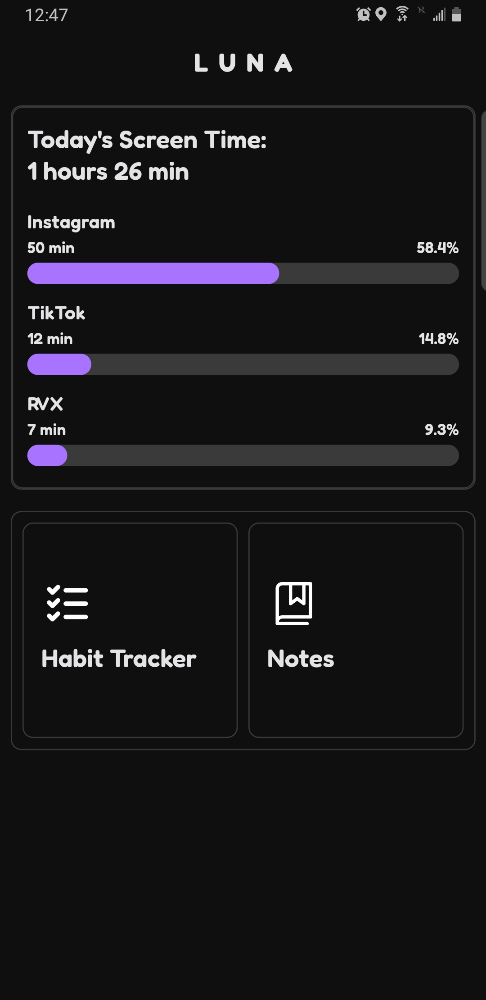
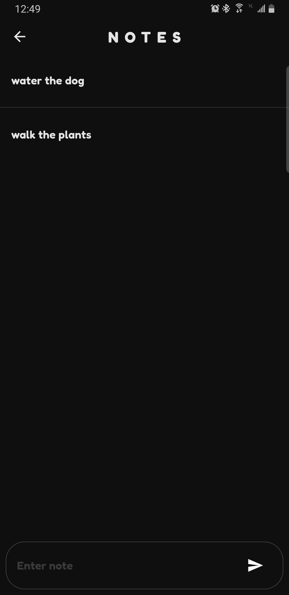
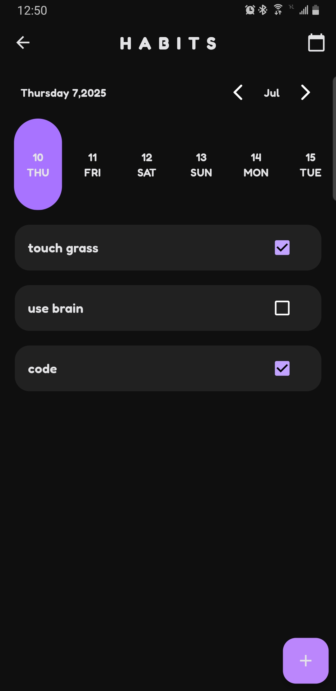
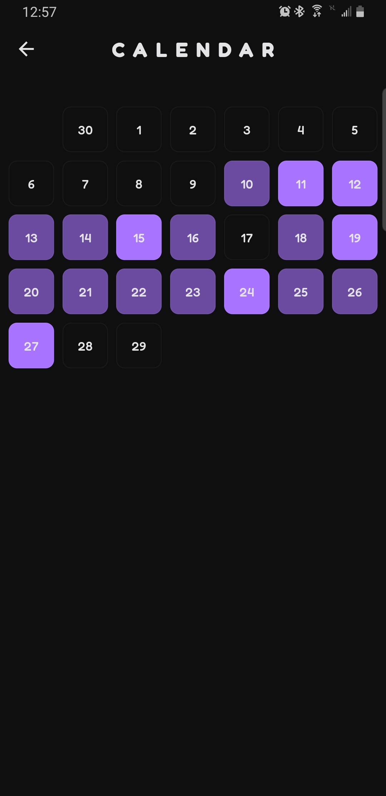

# Luna

A simple app built for personal needs.  
Designed only for personal use and not intended for public distribution.  
However, if you want to try out the app, any kind of feedback is greatly appreciated.

## ⚙️ Features

### Notes page
Take notes as you would send messages in a chat.
Great for quick thoughts, journaling, or ongoing logs.
No folders or formatting just tap and type.

### Habit Tracker  
Create daily habits and mark them off as you complete them.  
Visual progress lets you track consistency over time with a simple calendar view.

### Screentime  
Displays your three most-used apps over the past 24 hours.  
Useful for self-awareness and digital well-being.  

**All data is stored locally without needing to sign in or connect to the internet.**

## 🖼️ Screenshots
<h3>📱 Home Page</h3>

<h3>📝 Notes Page</h3>

<h3>✅ Habits Page</h3>

<h3>📆 Calendar Page</h3>

## 📦 Installation
Releases are only for Android at the moment.  
[Download Latest Release](https://github.com/sujalpoudel78/luna/releases/latest)  
To install the app, download the `.apk` from the link above and install it on your device.
When you first open the app it will open the usage access settings. From there search and enable Luna and restart the app to use the app.